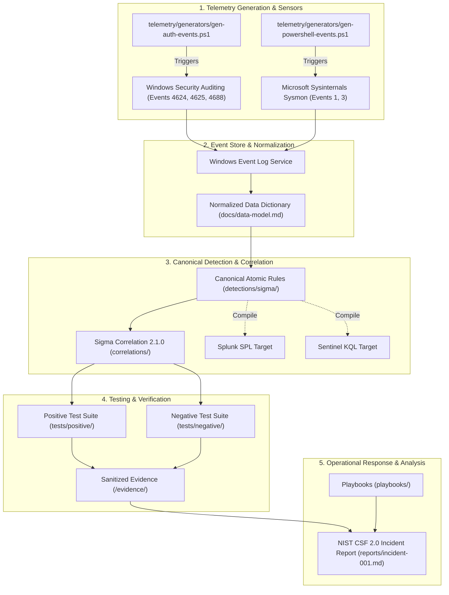

# JestineSOC: Security Operations & Detection Engineering Lab

> An enterprise-informed, reproducible security operations and detection engineering laboratory demonstrating identity security, endpoint telemetry, canonical detection engineering, multi-event correlation, positive/negative validation testing, and NIST CSF 2.0-aligned incident investigation.

[](.github/workflows/validate.yml)
[](https://sigmahq.io/)
[](https://www.nist.gov/)
[](LICENSE)

---

## 1. What This Project Proves

This project demonstrates verifiable, production-relevant competency across the defensive engineering lifecycle:

1. **Endpoint & Identity Telemetry Engineering:** Designing and capturing authentic Windows Security Audit events (Events 4624, 4625, 4688) and tuned Sysmon telemetry (Process Creation Event 1, Network Connection Event 3) without synthetic log fabrication.
2. **Canonical Detection Engineering:** Authoring vendor-neutral detection logic in **Sigma (Specification 2.1.0)** as the single source of truth, compiling to Splunk SPL and Microsoft Sentinel KQL while documenting backend-specific translation nuances.
3. **Temporal Multi-Event Correlation:** Implementing stateful, temporal correlation logic under the **Sigma Correlation Specification 2.1.0** with strict grouping keys (`TargetUserName` + `WorkstationName`/`IpAddress`) to eliminate cross-user false positives.
4. **Validation Rigor (Positive & Negative Testing):** Subjecting every rule to both attack simulation ($N \ge \text{threshold}$) and negative/boundary tests ($N < \text{threshold}$) to verify true-positive sensitivity and false-positive suppression.
5. **NIST CSF 2.0-Aligned Incident Response:** Documenting a forensic investigation and remediation plan mapped across all six core functions of the NIST Cybersecurity Framework 2.0 (*Govern, Identify, Protect, Detect, Respond, Recover*).
6. **Architectural Transparency:** Documenting design rationale through Architecture Decision Records (`/docs/adr/`) and maintaining a bidirectional Traceability Matrix.
7. **Safe AI Governance:** Formulating strict operational boundaries ("AI May" vs "AI May NOT") and benchmarking criteria for future AI-assisted triage without unconstrained automation risks.

---

## 2. Engineering Architecture & Data Flow



---

## 3. Repository Structure

```text
jestine-soc/
├── README.md                          # Platform overview & capability proof
├── LICENSE                            # MIT License
├── CHANGELOG.md                       # Semantic version history (v0.1.0 -> v1.0.0)
├── SECURITY.md                        # Vulnerability reporting & sanitization policy
├── .gitignore                         # Secret & noise suppression
│
├── docs/
│   ├── requirements.md                # System & Detection Engineering Requirements (FR/NFR)
│   ├── traceability-matrix.md         # Master control matrix (FR -> Design -> Test -> Evidence)
│   ├── lab-environment.md             # Workstation reproducibility specification
│   ├── architecture.md                # NIST CSF 2.0 system mapping & data flow
│   ├── data-model.md                  # Normalized field dictionary & telemetry mapping
│   ├── threat-model.md                # In-scope threat actors, assets, & non-goals
│   ├── detection-engineering.md       # 8-stage lifecycle & Sigma 2.1.0 correlation
│   ├── ai-validation.md               # Strict future AI boundaries & evaluation benchmark
│   └── adr/                           # Architecture Decision Records (ADR-001 to ADR-005)
│
├── detections/
│   ├── sigma/                         # Canonical vendor-neutral Sigma rules
│   ├── splunk/                        # Derived Splunk SPL translations
│   └── kql/                           # Derived Microsoft Sentinel KQL translations
│
├── correlations/                      # Sigma Correlation 2.1.0 rules
├── telemetry/                         # Tuned Sysmon XML & authentic event generators
├── tests/                             # Positive (attack) and Negative (benign) test harness
├── evidence/                          # Sanitized execution logs and JSON event records
├── playbooks/                         # Incident response standard operating procedures
└── reports/                           # Complete forensic investigation reports
```

---

## 4. Bounded Scope & Explicit Non-Claims

To maintain professional credibility, this lab explicitly defines its engineering boundaries:
* **Lab Environment:** Bounded strictly to controlled local Windows workstation telemetry (`LAB-HOST01`).
* **Non-Claim:** Does not simulate enterprise gigabyte-per-second SIEM ingestion clusters or multi-tenant infrastructure.
* **Non-Claim:** Demonstrates *alignment* with NIST SP 800-61 Rev. 3 and CSF 2.0; does not claim formal organizational compliance or certification.
* **Non-Claim:** Scoped to targeted high-fidelity MITRE ATT&CK techniques (`T1110.001`, `T1078.003`, `T1059.001`, `T1021.002`); does not claim complete enterprise matrix coverage.

---

## 5. Getting Started & Reproducibility

See the comprehensive [Laboratory Environment Specification](docs/lab-environment.md) for full system prerequisites, audit policies, and step-by-step setup commands.

---

## 6. Project Roadmap

* **Version 1 (Current Baseline):** Telemetry baseline, canonical Sigma detections, Sigma 2.1.0 correlation, positive/negative test suites, sanitized evidence, and one NIST-aligned incident investigation.
* **Version 2:** Threat Intelligence integration (AbuseIPDB, VirusTotal reputation scoring).
* **Version 3:** SOAR & automated triage dispatchers.
* **Version 4:** Incident ticket lifecycle management & evidence locker.
* **Version 5:** AI Analyst Assistant evaluation against the 20-incident benchmark.
* **Version 6:** Automated Sigma CI rule compilation pipeline.
* **Version 7:** Hybrid cloud identity telemetry integration (Microsoft Entra ID / Azure Sentinel).
* **Version 8:** Executive metrics dashboard (MTTD, MTTR, False Positive Rate, ATT&CK Coverage).
