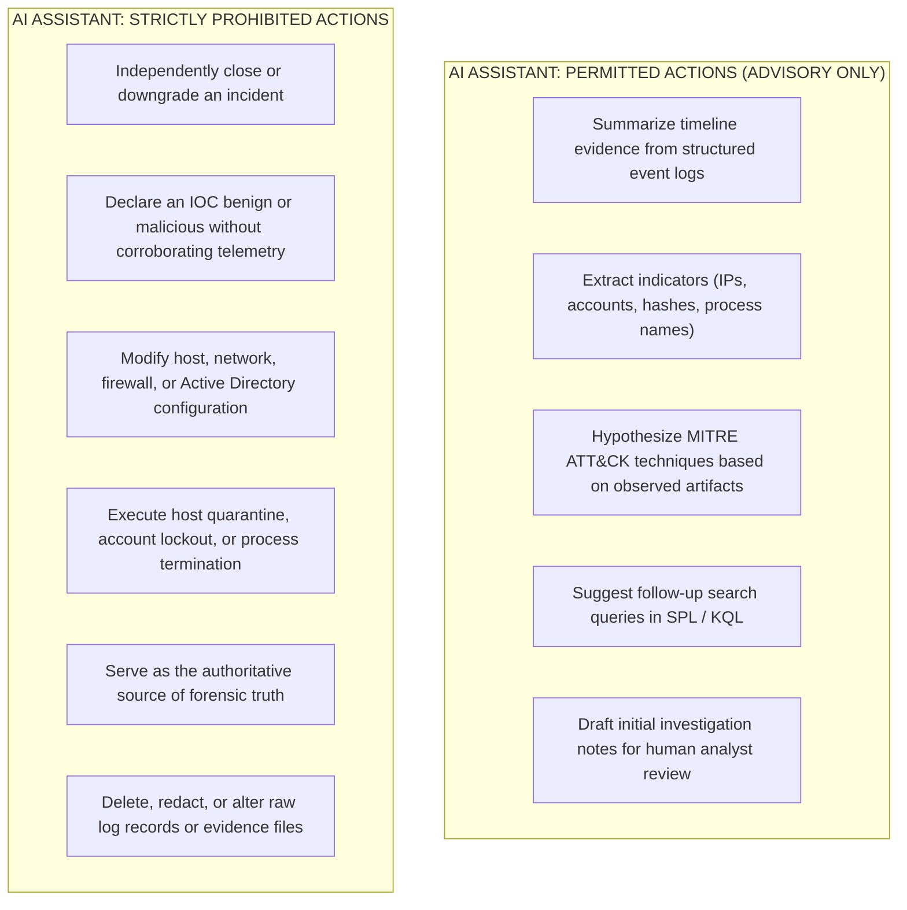

# JestineSOC: AI Validation & Operational Safety Boundaries

**Document ID:** AIV-V1-POLICY  
**Version:** v0.1.0  
**Classification:** Operational Governance Specification  

---

## 1. Context and Scope

In advanced security operations, Artificial Intelligence (AI) and Large Language Models (LLMs) can accelerate Tier-1 triage, synthesize complex telemetry, and hypothesize threat actor tactics. However, deploying AI without deterministic guardrails introduces operational vulnerabilities: hallucinations, incorrect attribution, premature incident closure, and unauthorized destructive remediation.

To enforce defensible security engineering, **AI execution is strictly excluded from JestineSOC Version 1**. Version 1 proves the deterministic telemetry, detection, and forensic foundations. 

This document defines the strict operational boundaries and evaluation criteria that will govern the AI analyst assistant when introduced in **Version 5**.

---

## 2. Operational Authority Boundaries

---

## 3. The 20-Incident Evaluation Benchmark (V5 Target)

Before any AI assistant module is merged into the platform in Version 5, it must be evaluated against a standardized test set of 20 historical and simulated incidents:

| Evaluation Metric | Target Acceptance Threshold | Description |
| :--- | :--- | :--- |
| **Factuality / Evidence Grounding** | **100%** | Every assertion in the AI summary must reference a verifiable event ID, timestamp, or field in the raw evidence log. |
| **Hallucination Rate** | **0%** | Zero fabricated IPs, process names, or non-existent telemetry attributes. |
| **MITRE ATT&CK Precision** | $\ge \mathbf{90\%}$ | Correct technique identification confirmed against analyst ground truth. |
| **Recommendation Soundness** | $\ge \mathbf{95\%}$ | Proposed next steps must align with NIST CSF 2.0 Incident Response playbooks. |

---

## 4. Auditor Verification Principle

An auditor inspecting JestineSOC can verify:
1. Version 1 functions entirely on verifiable, deterministic security engineering without dependence on black-box AI models.
2. The AI safety framework treats AI as an **assistant**, maintaining a mandatory **Human-in-the-Loop** model for all decisions and containment actions.
