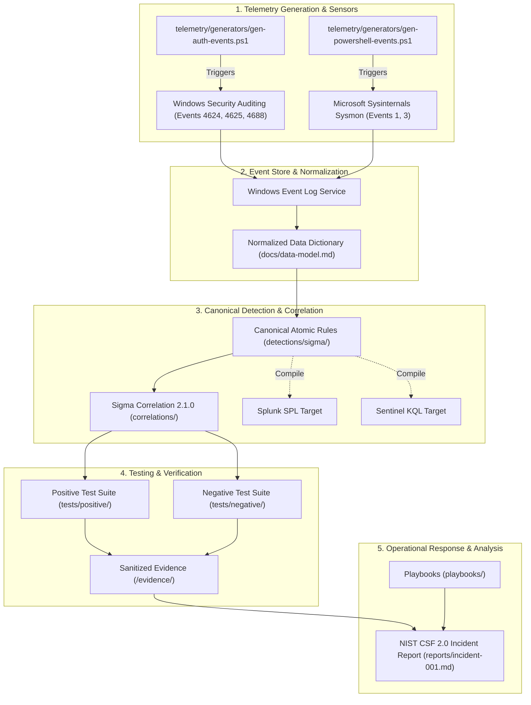

# JestineSOC: Architecture Specification & NIST CSF 2.0 Alignment

**Document ID:** ARC-V1-SPEC  
**Version:** v0.1.0  
**Framework Standards:** NIST SP 800-61 Rev. 3, NIST Cybersecurity Framework (CSF) 2.0  

---

## 1. System Architecture Overview

JestineSOC operates a decoupled, multi-tier detection engineering pipeline. The architecture decouples telemetry generation, event capture, canonical detection definition, stateful correlation, and structured incident investigation.

---

## 2. NIST Cybersecurity Framework (CSF) 2.0 Integration

In strict alignment with **NIST SP 800-61 Rev. 3** (finalized April 2025), incident response is structured across all six core functions of **NIST CSF 2.0**:

| CSF 2.0 Function | Specific NIST Category / Subcategory | JestineSOC Platform Implementation |
| :--- | :--- | :--- |
| **GOVERN (GV)** | `GV.OC-01`, `GV.PO-01` (Organizational Context & Policy) | Explicit requirements (`docs/requirements.md`), ADRs (`docs/adr/`), and testing criteria established prior to implementation. |
| **IDENTIFY (ID)** | `ID.AM-01`, `ID.RA-01` (Asset Management & Risk Assessment) | Asset inventory and threat modeling documented in `docs/threat-model.md` with explicit in-scope/out-of-scope boundaries. |
| **PROTECT (PR)** | `PR.AA-01`, `PR.PS-01` (Identity Management & Data Security) | Credential protection standards, local audit baseline enforcement (`telemetry/windows/audit-policy.md`), and pre-commit secret hygiene. |
| **DETECT (DE)** | `DE.CM-01`, `DE.AE-01` (Continuous Monitoring & Adverse Event Detection) | Tuned Sysmon configuration (`telemetry/sysmon/`), canonical Sigma atomic rules, and temporal correlation rules under Sigma Correlation Spec 2.1.0. |
| **RESPOND (RS)** | `RS.MA-01`, `RS.AN-01`, `RS.MI-01` (Incident Management, Analysis & Mitigation) | Operational incident response playbooks (`playbooks/account-compromise.md`) and Tier-1/Tier-2 forensic timeline reconstruction in `reports/incident-001.md`. |
| **RECOVER (RC)** | `RC.RP-01` (Recovery Execution & Restoration) | Account credential reset procedures, isolation rollback routines, and post-incident detection tuning documented in investigation reports. |

---

## 3. Data Flow & Sensor Boundaries

1. **Authentication Sensor:** Uses local LSASS security event generation. The telemetry script `gen-auth-events.ps1` calls legitimate Windows logon APIs using test accounts, ensuring Windows generates genuine 4625/4624 events with authentic logon types.
2. **Process Sensor:** Sysmon driver intercepts process execution and logs full command-line strings, parent-child process relationships, and unique `ProcessGuid` values.
3. **Correlation Engine:** Evaluates events temporally. A correlation alert is emitted only when the defined threshold of Event 4625 records matches within the sliding time window and is terminated by an Event 4624 record sharing the same `TargetUserName` and `WorkstationName`/`IpAddress`.
