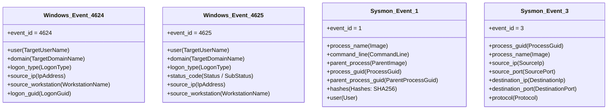

# JestineSOC: Telemetry Data Model & Field Dictionary

**Document ID:** DAT-V1-SCHEMA  
**Version:** v0.1.0  
**Classification:** Laboratory Standard  

---

## 1. Overview

To support multi-event correlation and cross-platform detection compilation, this document establishes the normalized data dictionary for JestineSOC. It defines core event fields, their data types, and explicitly maps which telemetry provider produces each field.

---

## 2. Core Field Dictionary

| Normalized Field | Data Type | Description | Example Value |
| :--- | :--- | :--- | :--- |
| `timestamp` | ISO-8601 String | UTC timestamp when the event was generated | `2026-09-14T10:45:00.123Z` |
| `event_id` | Integer | Numeric identifier of the event from the provider | `4625`, `1` |
| `provider` | String | Operating system log source or agent emitting telemetry | `Microsoft-Windows-Security-Auditing`, `Microsoft-Windows-Sysmon` |
| `host` | String | NetBIOS or FQDN hostname of the system recording the event | `LAB-HOST01` |
| `user` | String | Target username subject to authentication or process launch | `lab_user_test` |
| `domain` | String | Authentication domain or machine name | `LAB-HOST01`, `CONTOSO` |
| `logon_type` | Integer | Windows logon type categorizing the authentication mechanism | `2` (Interactive), `3` (Network), `10` (RDP) |
| `source_ip` | IP Address | IP address initiating authentication or network connection | `127.0.0.1`, `192.0.2.45` |
| `source_workstation` | String | Client machine name reported during authentication attempt | `WORKSTATION-X` |
| `destination_ip` | IP Address | Target IP address of a network socket | `198.51.100.10` |
| `destination_port` | Integer | Target port number of a network connection | `443`, `445`, `8000` |
| `process_name` | String | Filename of the executed executable | `powershell.exe`, `cmd.exe` |
| `process_path` | String | Full filesystem path to the executable | `C:\Windows\System32\WindowsPowerShell\v1.0\powershell.exe` |
| `command_line` | String | Complete command-line string including arguments | `powershell.exe -NoP -NonI -EncodedCommand ...` |
| `parent_process` | String | Name of the parent process that spawned the subject process | `explorer.exe`, `cmd.exe` |
| `process_guid` | String | Unique Sysmon-generated GUID for the process instance | `{A1234567-B890-CDEF-0123-456789ABCDEF}` |
| `status_code` | Hex / String | NTSTATUS failure code in authentication events | `0xC000006A` (Bad Password), `0xC0000064` (User does not exist) |

---

## 3. Telemetry Source Mapping

### 3.1 Field Extraction Detail

#### Windows Security Event 4624 (Logon Success)
* **Log:** `Security`
* **Source:** `Microsoft-Windows-Security-Auditing`
* **Mapped Fields:**
  * `TargetUserName` $\rightarrow$ `user`
  * `TargetDomainName` $\rightarrow$ `domain`
  * `LogonType` $\rightarrow$ `logon_type` (Type 2 = Interactive console, Type 3 = Network share/API, Type 10 = Remote Desktop)
  * `WorkstationName` $\rightarrow$ `source_workstation`
  * `IpAddress` $\rightarrow$ `source_ip`

#### Windows Security Event 4625 (Logon Failure)
* **Log:** `Security`
* **Source:** `Microsoft-Windows-Security-Auditing`
* **Mapped Fields:**
  * `TargetUserName` $\rightarrow$ `user`
  * `Status` / `SubStatus` $\rightarrow$ `status_code` (`0xC000006A`: incorrect password; `0xC0000064`: unknown user account)
  * `LogonType` $\rightarrow$ `logon_type`
  * `WorkstationName` $\rightarrow$ `source_workstation`
  * `IpAddress` $\rightarrow$ `source_ip`

#### Sysmon Event 1 (Process Creation)
* **Log:** `Microsoft-Windows-Sysmon/Operational`
* **Mapped Fields:**
  * `Image` $\rightarrow$ `process_path` / `process_name`
  * `CommandLine` $\rightarrow$ `command_line`
  * `ParentImage` $\rightarrow$ `parent_process`
  * `ProcessGuid` $\rightarrow$ `process_guid`
  * `User` $\rightarrow$ `user`

#### Sysmon Event 3 (Network Connection)
* **Log:** `Microsoft-Windows-Sysmon/Operational`
* **Mapped Fields:**
  * `ProcessGuid` $\rightarrow$ `process_guid` (Enables deterministic correlation with Sysmon Event 1)
  * `SourceIp` $\rightarrow$ `source_ip`
  * `DestinationIp` $\rightarrow$ `destination_ip`
  * `DestinationPort` $\rightarrow$ `destination_port`
