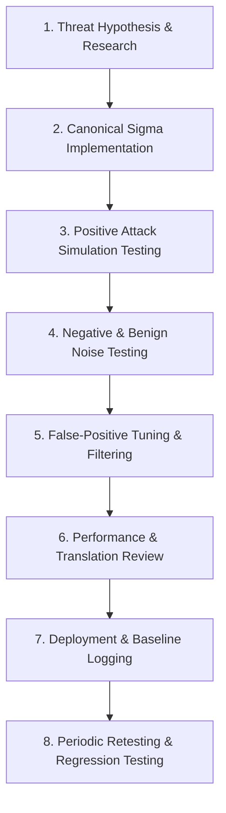

# JestineSOC: Detection Engineering Lifecycle & Methodology

**Document ID:** DET-V1-METHOD  
**Version:** v0.1.0  
**Standard Alignment:** Sigma Specification 2.1.0 / MITRE ATT&CK v15  

---

## 1. Detection Engineering Philosophy

A detection is not verified simply because it fires in the presence of an attack; it is verified only when it demonstrates both **sensitivity** (fires reliably on true attacks) and **specificity** (remains silent during routine or sub-threshold benign activity).

JestineSOC adheres to a structured, 8-stage detection engineering lifecycle:



---

## 2. Testing Framework & Evaluation Matrix

For every detection rule in JestineSOC, four boundary conditions are evaluated:

| Test Category | Operational Condition | Expected Result | Validation Criteria |
| :--- | :--- | :--- | :--- |
| **True Positive (Attack)** | Rapid credential guessing ($N \ge 5$ within 5 min) followed by valid login. | **ALERT GENERATED** | Severity: High. Correct MITRE tag: T1110.001. All correlation keys match. |
| **True Negative (Benign)** | Normal user entering bad password twice ($N = 2$) then logging in successfully. | **NO ALERT** | Rule logic suppresses alert; no notification emitted to analyst queue. |
| **Boundary Condition** | Exactly 4 failures ($N = 4$ when threshold is 5) within 5 min. | **NO ALERT** | Strict boundary adherence; sliding window resets correctly. |
| **Missing Telemetry** | Script executes without Sysmon running or Security auditing disabled. | **GRACEFUL SILENCE** | No script crash or false alert; system logs missing telemetry prerequisite. |

---

## 3. Sigma Correlation Specification 2.1.0 Implementation

Multi-event detections in JestineSOC utilize the **Sigma Correlation Specification 2.1.0** (released August 2025). 

Rather than embedding ad-hoc threshold logic inside a single monolithic rule, detections are factored into:
1. **Base Atomic Rules:** Independent Sigma rules defining individual event patterns (e.g. `windows_failed_logon.yml` and `windows_successful_logon.yml`).
2. **Correlation Rules:** A meta-rule defining the temporal aggregation, threshold, ordering, and grouping dimensions:

```yaml
# Conceptual Sigma Correlation 2.1.0 Syntax
name: Credential Brute-Force Followed by Successful Logon
correlation:
  type: temporal
  rules:
    - windows_failed_logon
    - windows_successful_logon
  group-by:
    - TargetUserName
    - WorkstationName
  timespan: 5m
  condition:
    - count(windows_failed_logon) >= 5
    - count(windows_successful_logon) == 1
```

### 3.1 Mandatory Correlation Dimensions (Grouping Keys)
To prevent cross-user false positives (e.g. User A, User B, and User C each mistyping their password once within 5 minutes being misidentified as a brute-force attack), correlation rules must strictly bind events via:
* **Account Dimension:** `TargetUserName`
* **Source Dimension:** `WorkstationName` and/or `IpAddress`
* **Temporal Window:** `timespan: 5m`

---

## 4. False-Positive Documentation & Tuning Protocol

Every rule must declare its documented false positives under the `falsepositives` key in Sigma:
* **Known Benign Triggers:** Vulnerability scanners, automated backup service accounts with expired passwords, or scheduled task account misconfigurations.
* **Tuning Guidance:** Methods for excluding known service account prefixes (e.g. `svc_*`) or trusted internal management subnets.
