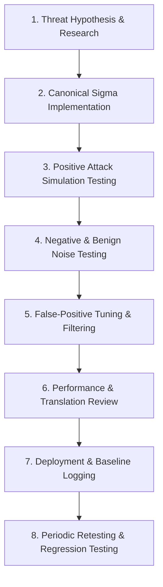
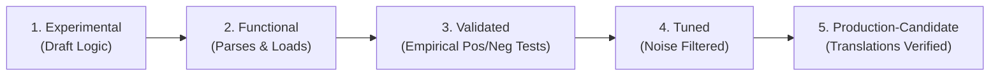

# JestineSOC: Detection Engineering Lifecycle & Methodology

**Document ID:** DET-V1-METHOD  
**Version:** v0.1.0  
**Standard Alignment:** Sigma Specification 2.1.0 / MITRE ATT&CK v15  

---

## 1. Detection Engineering Philosophy

A detection is not verified simply because it fires in the presence of an attack; it is verified only when it demonstrates both **sensitivity** (fires reliably on true attacks) and **specificity** (remains silent during routine or sub-threshold benign activity).

JestineSOC adheres to a structured, 8-stage detection engineering lifecycle:



---

## 2. Testing Framework & Evaluation Matrix

For every detection rule in JestineSOC, four boundary conditions are evaluated:

| Test Category | Operational Condition | Expected Result | Validation Criteria |
| :--- | :--- | :--- | :--- |
| **True Positive (Attack)** | Rapid credential guessing ($N \ge 5$ within 5 min) followed by valid login. | **ALERT GENERATED** | Severity: High. Correct MITRE tag: T1110.001. All correlation keys match. |
| **True Negative (Benign)** | Normal user entering bad password twice ($N = 2$) then logging in successfully. | **NO ALERT** | Rule logic suppresses alert; no notification emitted to analyst queue. |
| **Boundary Condition** | Exactly 4 failures ($N = 4$ when threshold is 5) within 5 min. | **NO ALERT** | Strict boundary adherence; sliding window resets correctly. |
| **Missing Telemetry** | Script executes without Sysmon running or Security auditing disabled. | **GRACEFUL SILENCE** | No script crash or false alert; system logs missing telemetry prerequisite. |

---

## 3. Sigma Correlation Specification 2.1.0 Implementation

Multi-event detections in JestineSOC utilize the **Sigma Correlation Specification 2.1.0** (released August 2025). 

Rather than embedding ad-hoc threshold logic inside a single monolithic rule, detections are factored into:
1. **Base Atomic Rules:** Independent Sigma rules defining individual event patterns (e.g. `windows_failed_logon.yml` and `windows_successful_logon.yml`).
2. **Correlation Rules:** A meta-rule defining the temporal aggregation, threshold, ordering, and grouping dimensions:

```yaml
# Conceptual Sigma Correlation 2.1.0 Syntax
name: Credential Brute-Force Followed by Successful Logon
correlation:
  type: temporal
  rules:
    - windows_failed_logon
    - windows_successful_logon
  group-by:
    - TargetUserName
    - WorkstationName
  timespan: 5m
  condition:
    - count(windows_failed_logon) >= 5
    - count(windows_successful_logon) == 1
```

### 3.1 Mandatory Correlation Dimensions (Grouping Keys)
To prevent cross-user false positives (e.g. User A, User B, and User C each mistyping their password once within 5 minutes being misidentified as a brute-force attack), correlation rules must strictly bind events via four explicit dimensions:
* **Account Dimension:** `TargetUserName` (exact case-insensitive account match)
* **Source Dimension:** `WorkstationName` and/or `IpAddress` (originating host/endpoint)
* **Destination Dimension:** `Computer` / target system hostname receiving the authentications
* **Temporal Window:** Defined interval (e.g., `timespan: 5m`)

Do not use vague correlations such as "multiple failures followed by a successful login." All correlation rules (e.g. `CORR-01`) must strictly evaluate:
$$\text{same account} + \text{same source} + \text{same destination} + \text{defined time window}$$

---

## 4. False-Positive Documentation & Tuning Protocol

Every rule must declare its documented false positives under the `falsepositives` key in Sigma:
* **Known Benign Triggers:** Vulnerability scanners, automated backup service accounts with expired passwords, or scheduled task account misconfigurations.
* **Tuning Guidance:** Methods for excluding known service account prefixes (e.g. `svc_*`) or trusted internal management subnets.

---

## 5. Detection Maturity Lifecycle & Progression Criteria

JestineSOC enforces an **evidence-driven** 5-stage maturity progression model. A detection's maturity is never determined by whether it passes syntax linting, but by empirical verification:



| Maturity Stage | Operational Definition | Mandatory Promotion Criteria |
| :--- | :--- | :--- |
| **Stage 1: Experimental** | Initial analytic draft or theoretical rule. | Rule hypothesis authored in Sigma YAML format; ATT&CK mapped. |
| **Stage 2: Functional** | Syntax valid and loadable by detection engines. | Passes `sigma check` (Sigma 2.1.0) and `yamllint`; logic matches sample logs. *(Note: Sigma linting $\ne$ validation).* |
| **Stage 3: Validated** | Empirically verified against active telemetry. | **Positive attack test fires reliably** AND **negative benign test cleanly suppresses**; raw JSON evidence committed with OS `RecordId` mapping. |
| **Stage 4: Tuned** | Filtered against documented false positives. | Operational noise scenarios tested; exclusions verified against boundary conditions ($N - 1$ attempts). |
| **Stage 5: Production-Candidate** | Fully documented and translated for multi-SIEM deployment. | Complete 23-section detection specification approved; verified SPL and KQL translations documented with semantic divergences. |

---

## 6. Mandatory Detection Specification Standard

Before any detection is implemented in Phase 2, an instance of the canonical **Detection Specification Template** must be authored:
* **Canonical Template:** [`docs/templates/detection-spec-template.md`](file:///c:/Users/jesti/OneDrive%20-%20Deakin%20University/Desktop/Portfolio/jestine-soc/docs/templates/detection-spec-template.md)
* **Mandatory Sections (23 Fields):** Detection ID, Name, Objective, Threat / Analytic Hypothesis, Data Sources, Required Telemetry Fields, Canonical Sigma Rule, MITRE ATT&CK Mapping, Positive Test, Negative Test, Expected Result, Actual Result, False-Positive Scenarios, Investigation Questions, Severity Rationale, Correlation/Grouping Logic, SPL Translation, KQL Translation, Semantic Divergence from Sigma, Evidence Location / Provenance, Maturity Level, Known Limitations / Non-Claims, and Acceptance Criteria.

