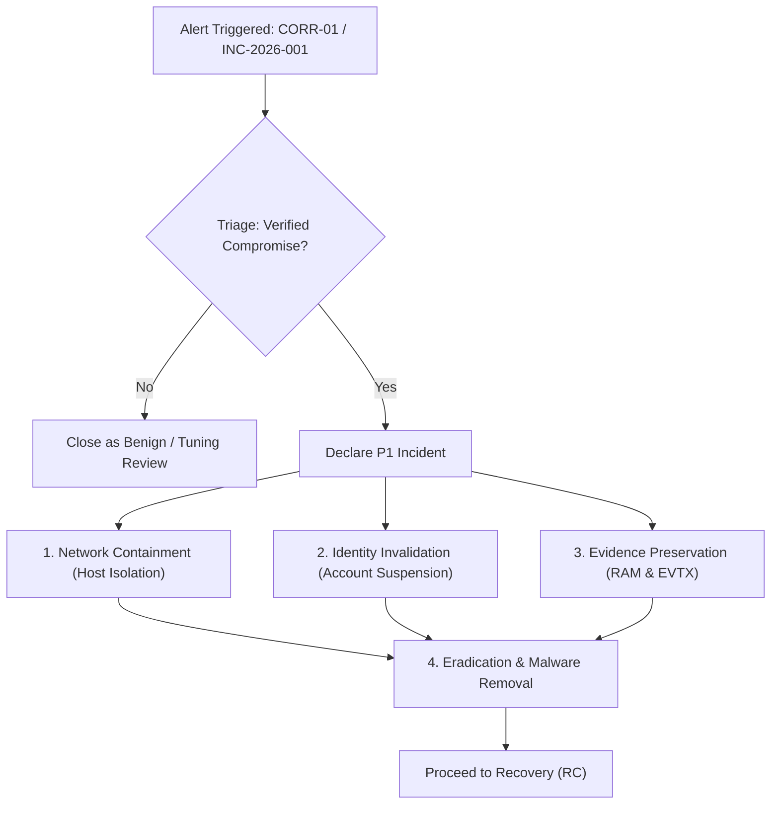

# IR-PLAYBOOK-001: Credential Compromise & Administrative Lateral Movement

**Playbook ID:** IR-PLAYBOOK-001  
**Version:** v1.0.0 (Production-Candidate)  
**Standard Alignment:** NIST CSF 2.0 / NIST SP 800-61 Rev. 3 / MITRE ATT&CK v15  
**Severity Classification:** **CRITICAL (P1)**  
**Target Threat Category:** Credential Access (`TA0006`) & Lateral Movement (`TA0008`)  
**Triggering Detections:** `CORR-01` (`mr_bruteforce_after_failures.yml`), `DET-03`, `DET-04`  

---

## 1. Governance & Context (GV)

### 1.1 Purpose & Authority
This standard operating procedure (SOP) governs the mandatory incident response actions required when automated correlation indicates a high-confidence credential brute-force attack succeeded by account compromise and subsequent post-exploitation activity (e.g. `INC-2026-001` / `SCEN-01`).

### 1.2 Roles & Responsibilities
| Role | Responsibilities | Contact / Escalation |
| :--- | :--- | :--- |
| **SOC Tier-1 Analyst** | Initial alert validation, triage checklist execution, severity verification, ticket escalation. | Immediate (within 10m of alert) |
| **SOC Tier-2 / IR Lead** | Endpoint isolation, session revocation, memory/disk artifact acquisition, deep forensic timeline analysis. | Escalated (within 20m of triage) |
| **Identity / Active Directory Admin** | Tier-0/1 account lockouts, password resets, Kerberos TGT invalidation (`krbtgt` double-rotation if domain admin). | Coordinated with IR Lead |
| **Incident Commander (CISO/SecOps Mgr)** | Stakeholder briefing, breach disclosure assessment, executive decision on network segmentation. | For verified P1/CRITICAL breaches |

---

## 2. Identification & Asset Classification (ID)

### 2.1 Asset & Identity Criticality Matrix
When an alert fires, determine the criticality tier of the affected asset and identity:

| Tier | Asset / Identity Classification | Escalation Mandate |
| :---: | :--- | :--- |
| **Tier 0** | Domain Controllers, PKI, ADFS, Entra Connect, Enterprise Admins, Domain Admins. | Immediate emergency isolation; CISO notification; emergency change freeze. |
| **Tier 1** | Server infrastructure, database clusters, SIEM/SOC infrastructure, service accounts with local admin rights. | Host isolation within 15 minutes; Active Directory ticket invalidation. |
| **Tier 2** | Standard workstations (`LAB-HOST01`), standard user identities (`lab_user_test`), departmental endpoints. | Standard containment within 30 minutes; forensic artifact capture. |

---

## 3. Protection & Hardening Baselines (PR)

The following preventive controls must be verified during and after an incident:

1. **Network Segmentation:** Enforce host-based Windows Defender Firewall rules blocking incoming TCP port 445 (SMB) and TCP port 135 (RPC) between client workstations (prevent workstation-to-workstation lateral movement).
2. **Account Hardening:**
   * Disable default local `Administrator` accounts or manage passwords via Microsoft LAPS (Local Administrator Password Solution).
   * Restrict administrative share access (`C$`, `ADMIN$`) to explicitly designated Privileged Access Workstations (PAWs).
3. **Authentication Hardening:** Enforce Multi-Factor Authentication (MFA) across all interactive and remote network access points; implement Account Lockout Thresholds ($\le 5$ invalid attempts within 15 minutes).

---

## 4. Detection & Initial Triage (DE)

### 4.1 Triggering Logic & Composite Alerting
An incident is opened automatically upon trigger of **`CORR-01`**:
* **Input Primitives:**
  * $\ge 5 \times$ Windows Security Event 4625 (LogonType 3) from identical `IpAddress` and `TargetUserName` within 5 minutes (`DET-01-PRIM`).
  * $1 \times$ Windows Security Event 4624 (LogonType 3) matching the same grouping key (`DET-02-PRIM`).
* **Subsequent Indicators:**
  * Sysmon Event ID 1 (`powershell.exe -enc ...` / `DET-03`).
  * Windows Security Event ID 5140/5145 (`ADMIN$`, `C$` / `DET-04`) or Sysmon Event ID 3 (Port 445).

### 4.2 5-Stage SOC Triage Checklist (First 15 Minutes)
1. [ ] **Verify Authentication Causality:** Review the preceding Event 4625 failure burst in SIEM. Confirm that the status code is `0xc000006d` / substatus `0xc000006a` (bad password) and not a system synchronization loop.
2. [ ] **Inspect Source IP Reputation:** Query threat intelligence (VirusTotal, AbuseIPDB) on the originating IP (e.g. `198.51.100.55`). Determine if the IP originates from a VPN, Tor exit node, cloud hosting provider, or known scanner.
3. [ ] **Decode Execution Payload:** If Sysmon Event 1 (`DET-03`) is present, extract the `-EncodedCommand` string. Decode from Base64 Unicode (UTF-16LE). Determine whether the payload executed discovery (`hostname`, `net user`), persistence, or credential dumping.
4. [ ] **Audit Share Access:** Inspect Event 5140/5145 (`DET-04`). Verify whether `ADMIN$` or `C$` was accessed. Check whether any file creation events occurred in `C:\Windows\System32\` or `C:\PerfLogs\`.
5. [ ] **Classify Incident Severity:** If successful authentication is accompanied by obfuscated execution or admin share access, classify immediately as **CRITICAL (P1)**.

---

## 5. Response & Containment Workflow (RS)



### 5.1 Immediate Containment Steps
1. **Network Isolation (Endpoint Containment):**
   * Via EDR / Host Firewall: Isolate the target host (`LAB-HOST01`) from all network communication except the management/SOC sensor tunnel.
   * PowerShell command:
     ```powershell
     # Isolate host via Windows Advanced Firewall
     New-NetFirewallRule -DisplayName "SOC-Emergency-Isolation" -Direction Inbound -Action Block -Profile Any
     New-NetFirewallRule -DisplayName "SOC-Emergency-Isolation-Out" -Direction Outbound -Action Block -Profile Any
     ```
2. **Account Disablement & Session Revocation:**
   * Disable the compromised user account:
     ```powershell
     Disable-LocalUser -Name "lab_user_test"
     # If Domain User:
     # Disable-ADAccount -Identity "lab_user_test"
     ```
   * Purge active Kerberos session tickets and terminate remote SMB/RPC sessions:
     ```powershell
     # Invalidate Kerberos tickets for current session
     klist purge
     # Terminate open network SMB sessions
     Get-SmbSession | Where-Object { $_.ClientUserName -like "*lab_user_test*" } | Close-SmbSession -Force
     ```

### 5.2 Evidence Preservation
* Acquire volatile memory using WinPmem or FTK Imager before rebooting the system.
* Export relevant Windows Event Logs (`Security.evtx`, `Microsoft-Windows-Sysmon/Operational.evtx`):
  ```powershell
  wevtutil epl Security C:\Forensics\Security-Compromise.evtx
  wevtutil epl Microsoft-Windows-Sysmon/Operational C:\Forensics\Sysmon-Compromise.evtx
  ```

### 5.3 Eradication
* Inspect all child processes spawned by `powershell.exe` or `cmd.exe` from the compromise timestamp onwards.
* Check scheduled tasks (`Get-ScheduledTask`), startup registry run keys (`HKLM\Software\Microsoft\Windows\CurrentVersion\Run`), and services for newly created persistence artifacts.
* Delete any staging payloads identified in administrative shares (`C$\Windows\Temp\*`, `ADMIN$\*`).

---

## 6. Recovery & Post-Incident Activity (RC)

### 6.1 System Restoration
1. **Credential Reset:** Re-enable account only after resetting password with minimum 16-character entropy and enforcing mandatory MFA.
2. **Baseline Verification:** Run full anti-malware and file integrity inspection on `LAB-HOST01` to ensure no rootkits or persistence implants remain.
3. **Re-connection:** Remove the isolation firewall rule and restore standard network connectivity.
4. **Enhanced Telemetry Monitoring:** Place `LAB-HOST01` and `lab_user_test` under hyper-care monitoring for 14 days, with zero alert aggregation threshold.

### 6.2 Lessons Learned & Continuous Improvement
Within 7 business days of incident closure, conduct a Post-Incident Review (PIR) addressing:
* Was the 5-minute sliding correlation window sufficient to detect the brute-force attempt?
* Did the SIEM translation correctly capture all source and destination entities?
* Were administrative shares strictly necessary for the affected user's business duties? (If not, remove local administrative privileges).
