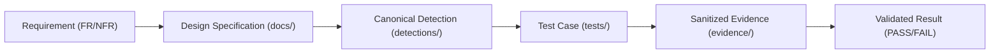

# JestineSOC: System & Detection Engineering Requirements

**Project Name:** JestineSOC — Security Operations & Detection Engineering Lab  
**Document ID:** REQ-V1-BASELINE  
**Version:** v0.1.0 (Frozen Baseline)  
**Classification:** Public / Laboratory Standard  
**Framework Alignment:** NIST SP 800-61 Rev. 3, NIST CSF 2.0, MITRE ATT&CK v15  

---

## 1. Executive Summary & Purpose

JestineSOC is an enterprise-informed, reproducible security operations and detection engineering laboratory. It is engineered to demonstrate verifiable competency across the end-to-end defensive lifecycle:

$$\text{Requirement} \longrightarrow \text{Design} \longrightarrow \text{Telemetry} \longrightarrow \text{Detection} \longrightarrow \text{Correlation} \longrightarrow \text{Test} \longrightarrow \text{Evidence} \longrightarrow \text{Investigation} \longrightarrow \text{Result}$$

This project does not attempt to construct a commercial product or claim unvalidated enterprise scale. Instead, it provides a strictly controlled, empirically validated environment demonstrating identity security, endpoint telemetry collection, canonical detection engineering, multi-event correlation, positive/negative validation testing, and forensic investigation.

---

## 2. Project Boundaries & Explicit Non-Claims

In accordance with professional engineering ethics and defensive auditing standards, this project explicitly defines what it proves and what it **does not** prove:

### 2.1 In-Scope Capabilities (What this project proves)
1. **Telemetry Engineering:** Design and capture of Windows Security Audit events (4624, 4625, 4688) and tuned Sysmon telemetry (Events 1, 3).
2. **Canonical Detection Engineering:** Authoring vendor-neutral detection logic in Sigma (Specification 2.1.0) and deriving query targets (Splunk SPL, Sentinel KQL) with documented translation caveats.
3. **Multi-Event Correlation:** Implementing stateful, temporal correlation logic under the Sigma Correlation Specification 2.1.0 using explicit grouping keys.
4. **Validation Rigor:** Subjecting detections to both positive (true attack) and negative (benign activity / boundary) test suites to measure sensitivity and specificity.
5. **Incident Investigation:** Documenting a forensic investigation mapped directly to the six NIST Cybersecurity Framework (CSF) 2.0 functions.
6. **Safety & Governance:** Establishing strict operational boundaries for future AI integration and zero-secret credential hygiene.

### 2.2 Explicit Non-Claims (What this project does NOT prove)
* **No Claim of Production Scale:** This lab does not simulate gigabyte-per-second ingestion pipelines, distributed cluster performance, or multi-tenant cloud architectures.
* **No Claim of Regulatory Compliance:** This laboratory demonstrates *alignment* with NIST SP 800-61 Rev. 3 and NIST CSF 2.0 principles; it does not claim compliance or accreditation against any external standard.
* **No Claim of Exhaustive ATT&CK Coverage:** Detections are scoped strictly to selected, high-fidelity techniques (T1110, T1059.001, T1078, T1021).
* **No Real-World Attack Execution:** Telemetry generators trigger authentic operating system events through benign, controlled API calls and authentication routines; no external systems, third-party targets, or destructive payloads are employed.

---

## 3. Traceability Architecture

Every component built within JestineSOC must trace back through a strict engineering lineage:



---

## 4. Functional Requirements (FR)

| Requirement ID | Title | Description & Scope | Acceptance Criteria |
| :--- | :--- | :--- | :--- |
| **FR-01** | Windows Authentication Telemetry | Capture Windows Security Event Log telemetry for successful and failed authentications. | Emits authentic Event 4625 (Logon Failure) and Event 4624 (Logon Success) with valid `TargetUserName`, `WorkstationName`, and `LogonType` (Type 2, 3, or 10). Synthetic event injection is prohibited. |
| **FR-02** | Sysmon Endpoint Telemetry | Capture endpoint process creation and network connection telemetry. | Sysmon captures Event ID 1 (Process Creation with `CommandLine`, `ParentCommandLine`, `ProcessGuid`) and Event ID 3 (Network Connection) with zero dropped events during test executions. |
| **FR-03** | Canonical Atomic Detection: Failed Authentication | Author vendor-neutral atomic detection for individual failed logon attempts. | Valid Sigma 2.1.0 rule identifying Event 4625 with mapped `Status` / `SubStatus` codes and MITRE ATT&CK T1110 tag. |
| **FR-04** | Canonical Correlation: Brute-Force Sequence | Author stateful correlation detecting credential brute-force followed by compromise. | Sigma Correlation 2.1.0 rule firing when $\ge 5$ failed authentications occur within a 5-minute temporal window followed by a successful authentication, grouped strictly by identical `TargetUserName` and `WorkstationName`/`IpAddress`. |
| **FR-05** | Negative Testing & False-Positive Suppression | Implement test harness to verify rule silence against benign administrative noise. | Executing sub-threshold attempts ($N = 2$) or routine administrative logons produces zero alert output. |
| **FR-06** | MITRE ATT&CK Provenance | Map all detection logic to standardized MITRE ATT&CK Enterprise matrices. | Detections specify valid Technique ID, Sub-Technique ID, Tactic, and an explicit justification narrative. |
| **FR-07** | False-Positive & Edge-Case Documentation | Define operational conditions where detection may generate benign alerts. | Every detection includes a dedicated `falsepositives` block and field tuning recommendations. |
| **FR-08** | Multi-Target SIEM Translation | Derive query syntax for production backends from canonical Sigma definitions. | Detections provide functional SPL (Splunk) and KQL (Microsoft Sentinel) equivalents, explicitly documenting any translation caveats or semantic non-equivalencies. |

---

## 5. Non-Functional Requirements (NFR)

| Requirement ID | Category | Requirement Description | Acceptance Criteria |
| :--- | :--- | :--- | :--- |
| **NFR-01** | Reproducibility | The entire lab environment must be rebuildable and verifiable from a clean workstation. | Detailed in `docs/lab-environment.md` with explicit OS, runtime, tooling, and version constraints. |
| **NFR-02** | Credential & Secret Hygiene | Zero sensitive credentials, tokens, or private secrets committed. | Pre-commit validation and CI scanning ensure no active API keys, real domain passwords, or personal credentials exist in repository history. |
| **NFR-03** | Evidence Sanitization | Telemetry logs, event captures, and investigative reports must be sanitized. | All artifacts committed to `/evidence/` utilize sanitized RFC 5737 IP ranges (`192.0.2.0/24`, `198.51.100.0/24`), generic domain names (`lab.local`), and synthetic usernames (`analyst_test`, `service_svc`). |
| **NFR-04** | Continuous Integration Quality Gate | Automated pipeline validation on every Git commit/PR. | GitHub Actions workflow `.github/workflows/validate.yml` enforces YAML syntax, Sigma rule linting, Markdown formatting, and PowerShell syntax validation. |

---

## 6. Detection Maturity Model

To distinguish mature detection engineering from ad-hoc query writing, every detection artifact within JestineSOC must declare its lifecycle maturity level:

```text
[Experimental] ──> [Functional] ──> [Validated] ──> [Tuned] ──> [Production-Candidate]
```

1. **Experimental:** Hypothesis formulated; logic drafted in Sigma; unverified against live telemetry.
2. **Functional:** Verified to parse and translate into target backends (SPL/KQL); preliminary positive test fires.
3. **Validated:** Positive test passed ($N \ge \text{threshold}$); negative test passed ($N < \text{threshold}$); raw telemetry evidence captured and logged.
4. **Tuned:** False-positive scenarios documented; exclusions and noise-reduction filters applied and verified.
5. **Production-Candidate:** Peer-reviewed (audited); full traceability established (`FR` $\rightarrow$ `DES` $\rightarrow$ `DET` $\rightarrow$ `TC` $\rightarrow$ `EV`); ready for operational deployment consideration.

---

## 7. Version 1 Definition of Done (The 7 Auditor Questions)

Version 1 is officially complete and accepted when an independent technical auditor or hiring manager can clone the repository and affirm:

1. **Can I reproduce the detection?** (The reviewer can run the provided scripts and observe the detection trigger).
2. **Can I inspect the raw telemetry?** (Sanitized event logs and structured JSON/EVTX records are present in `/evidence/`).
3. **Can I understand why the rule fired?** (The rule logic, threshold, and temporal window are clear, canonical, and self-documenting).
4. **Can I reproduce the negative test?** (The reviewer can execute the sub-threshold test and observe zero false alerts).
5. **Can I follow the forensic investigation?** (The incident investigation report reconstructs the attack timeline with concrete evidence).
6. **Can I understand the remediation?** (Containment and recovery actions are traceable directly to NIST CSF 2.0).
7. **Can I understand what the system does NOT prove?** (The project boundaries, lab constraints, and explicit non-claims are documented and respected).

---

## 8. Requirements Traceability Matrix Baseline

| Req ID | Target Design Doc | Target Detection / File | Test Case ID | Target Evidence Artifact | V1 Target Status |
| :--- | :--- | :--- | :--- | :--- | :--- |
| **FR-01** | `docs/data-model.md` | `telemetry/windows/audit-policy.md` | `TC-TEL-001` | `evidence/telemetry/evtx-auth-sample.json` | Pending V1 |
| **FR-02** | `docs/data-model.md` | `telemetry/sysmon/sysmon-config.xml` | `TC-TEL-002` | `evidence/telemetry/sysmon-sample.json` | Pending V1 |
| **FR-03** | `docs/detection-engineering.md` | `detections/sigma/windows_failed_logon.yml` | `TC-POS-001` | `evidence/detections/ev-atomic-failed-logon.log` | Pending V1 |
| **FR-04** | `docs/detection-engineering.md` | `correlations/mr_bruteforce_after_failures.yml` | `TC-POS-004` | `evidence/detections/ev-bruteforce-correlation.log` | Pending V1 |
| **FR-05** | `docs/testing.md` | `tests/negative/test_bruteforce_negative.ps1` | `TC-NEG-004` | `evidence/detections/ev-neg-test-suppressed.log` | Pending V1 |
| **FR-06** | `docs/threat-model.md` | `detections/sigma/*.yml` | `TC-AUD-001` | `docs/traceability-matrix.md` | Pending V1 |
| **FR-07** | `docs/detection-engineering.md` | `detections/sigma/*.yml` | `TC-AUD-002` | `docs/detection-engineering.md` | Pending V1 |
| **FR-08** | `docs/adr/ADR-003-*.md` | `detections/splunk/`, `detections/kql/` | `TC-AUD-003` | `evidence/detections/ev-translation-log.md` | Pending V1 |
| **NFR-01**| `docs/lab-environment.md` | `README.md` | `TC-ENV-001` | `docs/lab-environment.md` | Pending V1 |
| **NFR-02**| `docs/architecture.md` | `.gitignore`, `SECURITY.md` | `TC-SEC-001` | `evidence/ci/trufflehog-clean.log` | Pending V1 |
| **NFR-03**| `docs/data-model.md` | `evidence/` | `TC-SEC-002` | `evidence/` review | Pending V1 |
| **NFR-04**| `docs/architecture.md` | `.github/workflows/validate.yml` | `TC-CI-001` | `evidence/ci/ci-build-pass.log` | Pending V1 |
