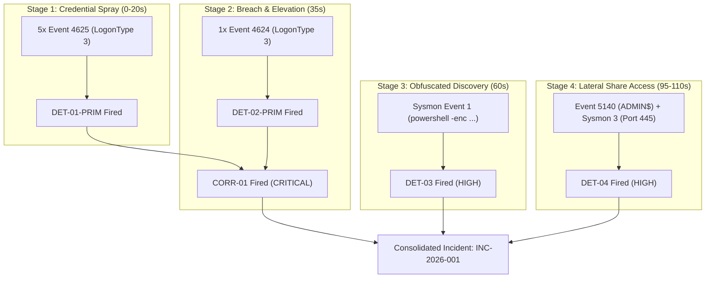

# SCEN-01: Credential Brute-Force to Administrative Lateral Movement

**Scenario ID:** SCEN-01  
**Classification:** Laboratory Incident Simulation & Multi-Stage Correlation Baseline  
**Target Host:** `LAB-HOST01` (`192.0.2.100`)  
**Threat Actor Profile:** `APT-LAB-01` (Simulated External Adversary)  
**Target Identity:** `LAB\lab_user_test`  
**Standard Alignment:** NIST SP 800-61 Rev. 3 / NIST CSF 2.0 / MITRE ATT&CK v15  

---

## 1. Executive Summary & Threat Narrative

This scenario demonstrates an end-to-end, multi-stage intrusion lifecycle against a Windows endpoint within the JestineSOC laboratory. An external adversary (`APT-LAB-01`) operating from an external staging address (`198.51.100.55`) executes a coordinated credential guessing campaign against Windows Network Authentication (SMB), achieves interactive credential access, executes obfuscated discovery commands via Windows PowerShell, and immediately stages lateral movement across administrative shares (`ADMIN$`, `C$`).

The objective of `SCEN-01` is to validate that JestineSOC's detection engineering framework detects every individual stage atomically, correlates the initial breach with temporal precision, and produces an actionable, consolidated SOC incident context without generating alert fatigue on benign operational noise.

```
+-------------------------------------------------------------------------------------------------------+
|                                         SCEN-01 ATTACK LIFECYCLE                                      |
+-------------------------------------------------------------------------------------------------------+
| [ Stage 1: Brute Force ] ──> [ Stage 2: Logon Breach ] ──> [ Stage 3: Obfuscated Exec ] ──> [ Stage 4: Lateral Share Access ] |
|   (DET-01-PRIM: 4625)           (DET-02-PRIM: 4624)          (DET-03: Sysmon 1 -enc)         (DET-04: Sec 5140 / Sysmon 3)   |
|         |                             |                                                                                      |
|         +--------------+--------------+                                                                                      |
|                        |                                                                                                     |
|                        v                                                                                                     |
|             [ CORR-01 (CRITICAL) ]                                                                                           |
+-------------------------------------------------------------------------------------------------------+
```

---

## 2. MITRE ATT&CK Enterprise Matrix Alignment

| Stage | ATT&CK Tactic | Technique ID | Technique Name | Detection Component | Telemetry Logsource | Alert Level |
| :---: | :--- | :--- | :--- | :--- | :--- | :---: |
| **1** | [TA0006](https://attack.mitre.org/tactics/TA0006/) Credential Access | [T1110.001](https://attack.mitre.org/techniques/T1110/001/) | Brute Force: Password Guessing | `DET-01-PRIM` | Security Event 4625 (LogonType 3) | `low` (Primitive) |
| **2** | [TA0001](https://attack.mitre.org/tactics/TA0001/) Initial Access / [TA0003](https://attack.mitre.org/tactics/TA0003/) Persistence | [T1078.003](https://attack.mitre.org/techniques/T1078/003/) | Valid Accounts: Local Accounts | `DET-02-PRIM`<br>**`CORR-01`** | Security Event 4624 (LogonType 3)<br>Temporal Sliding Join (5m) | `low` (Primitive)<br>**`critical`** (Composite) |
| **3** | [TA0002](https://attack.mitre.org/tactics/TA0002/) Execution / [TA0005](https://attack.mitre.org/tactics/TA0005/) Defense Evasion | [T1059.001](https://attack.mitre.org/techniques/T1059/001/)<br>[T1027](https://attack.mitre.org/techniques/T1027/) | PowerShell<br>Obfuscated Files/Info | `DET-03` | Sysmon Event 1 / Security Event 4688 | `high` |
| **4** | [TA0008](https://attack.mitre.org/tactics/TA0008/) Lateral Movement | [T1021.002](https://attack.mitre.org/techniques/T1021/002/) | Remote Services: SMB/Admin Shares | `DET-04` | Security Event 5140/5145 / Sysmon Event 3 | `high` |

---

## 3. Chronological Telemetry Event Timeline

The following timeline details the synthetic progression of events over an elapsed window of 180 seconds ($t_0$ to $t_0 + 180\text{s}$):

| Relative Time | Event ID | Log Source | Principal / Account | Source IP | Destination / Target | Specific Event Attributes | Triggered Detection State |
| :---: | :---: | :---: | :---: | :---: | :---: | :--- | :--- |
| **$t_0 + 00\text{s}$** | 4625 | Security | `lab_user_test` | `198.51.100.55` | `LAB-HOST01` | LogonType 3, Status `0xc000006d`, SubStatus `0xc000006a` | `DET-01-PRIM` (1/5) |
| **$t_0 + 05\text{s}$** | 4625 | Security | `lab_user_test` | `198.51.100.55` | `LAB-HOST01` | LogonType 3, Status `0xc000006d`, SubStatus `0xc000006a` | `DET-01-PRIM` (2/5) |
| **$t_0 + 10\text{s}$** | 4625 | Security | `lab_user_test` | `198.51.100.55` | `LAB-HOST01` | LogonType 3, Status `0xc000006d`, SubStatus `0xc000006a` | `DET-01-PRIM` (3/5) |
| **$t_0 + 15\text{s}$** | 4625 | Security | `lab_user_test` | `198.51.100.55` | `LAB-HOST01` | LogonType 3, Status `0xc000006d`, SubStatus `0xc000006a` | `DET-01-PRIM` (4/5) |
| **$t_0 + 20\text{s}$** | 4625 | Security | `lab_user_test` | `198.51.100.55` | `LAB-HOST01` | LogonType 3, Status `0xc000006d`, SubStatus `0xc000006a` | `DET-01-PRIM` (5/5 $\ge$ Threshold) |
| **$t_0 + 35\text{s}$** | 4624 | Security | `lab_user_test` | `198.51.100.55` | `LAB-HOST01` | LogonType 3, AuthenticationPackage: `NTLM` / `Kerberos` | `DET-02-PRIM` MATCH<br>**`CORR-01` ALERT (CRITICAL)** |
| **$t_0 + 60\text{s}$** | 1 | Sysmon | `lab_user_test` | Local | `powershell.exe` | Parent: `services.exe` / `cmd.exe`<br>CLI: `powershell.exe -enc VwByAGkAdABl...` | **`DET-03` ALERT (HIGH)** |
| **$t_0 + 95\text{s}$** | 5140 | Security | `lab_user_test` | `198.51.100.55` | `\\*\ADMIN$` | ShareName: `\\*\ADMIN$`, AccessMask: `0x1` | **`DET-04` ALERT (HIGH)** |
| **$t_0 + 110\text{s}$** | 3 | Sysmon | `lab_user_test` | `198.51.100.55` | Port 445 (`microsoft-ds`) | Image: `cmd.exe`, Protocol: `tcp` | **`DET-04` ALERT (HIGH)** |

---

## 4. SOC Analyst Incident Context & Alert Fusion (`INC-2026-001`)

In an enterprise SOC operating with Splunk Enterprise Security or Microsoft Sentinel, standalone detection alerts can overwhelm tier-1 analysts. `SCEN-01` demonstrates modern **Alert Fusion & Temporal Grouping**:

### Incident Header
* **Incident ID:** `INC-2026-001`
* **Title:** Multi-Stage Host Compromise and Administrative Lateral Movement
* **Severity:** **CRITICAL** (Escalated from High due to sequential correlation)
* **Impacted Asset:** `LAB-HOST01` (`192.0.2.100`)
* **Compromised Account:** `LAB\lab_user_test`
* **Threat Source:** `198.51.100.55` (External Untrusted IP)

### Attack Progression Graph


### 5-Minute Triage Checklist for SOC Analysts
1. **Scope Verification:** Check whether `lab_user_test` is a domain administrator or member of local `Administrators` group on `LAB-HOST01`.
2. **Credential Revocation:** Immediately reset password and invalidate Kerberos TGT/session tickets for `lab_user_test`.
3. **Command De-obfuscation:** Extract the base64 payload from the `DET-03` Sysmon Event 1 `CommandLine` field; decode Unicode UTF-16LE characters to inspect actor intentions.
4. **Share Audit:** Review Event 5145 on `ADMIN$` / `C$` to determine if any malicious binaries or staging scripts were written to `C:\Windows\` or `C:\PerfLogs\`.
5. **Host Containment:** Issue endpoint network isolation on `LAB-HOST01` to sever established SMB and RPC sessions.

---

## 5. Scope Limitations & Non-Claims (`SL-15`, `SL-16`)

* **`SL-15` (Linear Progression Assumption):** `SCEN-01` demonstrates a classical linear intrusion model ($T1110 \rightarrow T1078 \rightarrow T1059 \rightarrow T1021$). Advanced adversaries frequently interleave persistence or sleep intervals spanning days/weeks.
* **`SL-16` (Benign Payload Safety Boundary):** In accordance with JestineSOC ethical guidelines, simulated commands execute exclusively non-destructive routines (`Write-Output`, `Get-Date`, `hostname`). No real-world tooling (e.g. Mimikatz, Cobalt Strike, Impacket) is employed.
