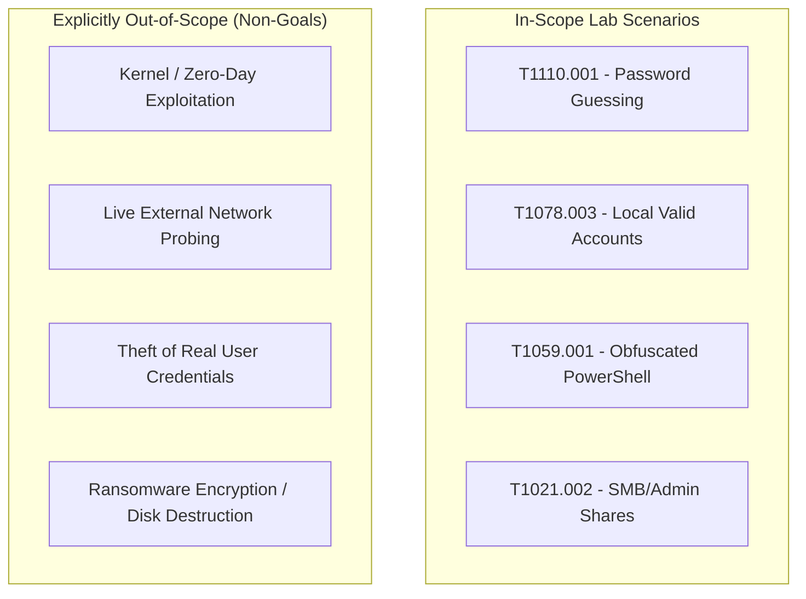

# JestineSOC: Threat Model & Operational Boundary

**Document ID:** THM-V1-SPEC  
**Version:** v0.1.0  
**Standard Alignment:** STRIDE / MITRE ATT&CK Enterprise v15  

---

## 1. Overview & Objective

This document formalizes the threat landscape, asset inventory, in-scope threat actors, and attack techniques evaluated within JestineSOC Version 1. In accordance with defensive engineering principles, strict operational boundaries are drawn to prevent unconstrained lab scope.

---

## 2. Asset Inventory (V1 Scope)

| Asset Category | Target Assets | Security Objective | Critical Telemetry |
| :--- | :--- | :--- | :--- |
| **Identity / Credentials** | Local accounts (`lab_user_test`), Administrator accounts, Kerberos/NTLM tickets | Confidentiality & Integrity against guessing and spraying | Windows Security Event 4624, 4625 |
| **Endpoints** | Windows 10/11 Lab Workstation (`LAB-HOST01`) | Execution integrity, prevention of unauthorized script execution | Sysmon Event 1 (Process Creation), Windows 4688 |
| **Network Interfaces** | Local loopback, internal management listeners, RDP port 3389, SMB port 445 | Non-exposure to unauthorized connections | Sysmon Event 3 (Network Connection) |
| **Audit & Log Store** | Local EVTX logs, SIEM forwarder queues, detection evaluation engines | Non-repudiation, tamper-resistance | Event Log service status (Event 1102) |

---

## 3. Threat Actors (In-Scope)

1. **External Credential Opportunist:** An automated threat actor attempting brute-force password guessing against exposed authentication endpoints using common password lists.
2. **Post-Compromise Local Operator:** An adversary possessing valid local credentials attempting stealthy execution using native Windows command interpreters (Living off the Land / LOLBins like PowerShell) with obfuscation flags.

---

## 4. In-Scope Techniques & Out-of-Scope Boundaries

### 4.1 In-Scope MITRE ATT&CK Techniques
* **T1110.001 (Brute Force: Password Guessing):** Controlled rapid authentication attempts with invalid credentials against a designated test user.
* **T1078.003 (Valid Accounts: Local Accounts):** Successful authentication following repeated failures or from unexpected source contexts.
* **T1059.001 (Command & Scripting Interpreter: PowerShell):** Execution of PowerShell with obfuscation parameters (`-EncodedCommand`, `-WindowStyle Hidden`, `-ExecutionPolicy Bypass`).
* **T1021.002 (Remote Services: SMB/Windows Admin Shares):** Controlled remote loopback authentication simulating network share traversal.

### 4.2 Explicitly Out-of-Scope Activities
* **Zero-Day or Memory-Corruption Exploitation:** No exploitation of operating system vulnerabilities is performed.
* **Live Enterprise Infrastructure Probing:** No packets are routed to external enterprise or commercial networks.
* **Destructive Payloads:** Telemetry generators do not delete files, manipulate MBR/VSS, or encrypt data.
