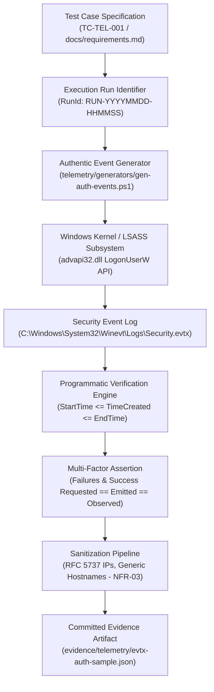

# Telemetry Evidence Provenance & Verification Architecture

This document formalizes the chain of custody, provenance lifecycle, and multi-factor verification architecture for all telemetry evidence committed to the JestineSOC repository.

---

## 1. Evidence Provenance Lifecycle

Every telemetry sample in `evidence/telemetry/` originates from genuine operating system activity executed by a deterministic generator, verified against native event logs, sanitized according to `NFR-03`, and linked to an explicit test case ID.



---

## 2. Seven-Stage Provenance Chain

| Stage | Name | Description | Verification Artifact |
| :--- | :--- | :--- | :--- |
| **Stage 1** | **Requirement Definition** | Functional requirements `FR-01` (Authentication Failures) and `FR-02` (Logon Correlation) defined in `docs/requirements.md`. | `docs/requirements.md` / `docs/traceability-matrix.md` |
| **Stage 2** | **Test Case Formulation** | Formal test case ID (e.g., `TC-TEL-001`) with predefined thresholds: 5 failed logons followed by 1 successful logon. | `docs/detection-engineering.md` |
| **Stage 3** | **Authentic Execution** | Native Win32 `advapi32.dll LogonUserW` invoked with `LOGON32_LOGON_NETWORK` (LogonType = 3). No synthetic event injection. | `telemetry/generators/gen-auth-events.ps1` |
| **Stage 4** | **Kernel Auditing** | Windows Local Security Authority Subsystem Service (LSASS) records Event 4625 for invalid credentials and Event 4624 for valid credentials. | `Security.evtx` |
| **Stage 5** | **Programmatic Verification** | `Get-WinEvent` queries `Security.evtx` strictly bounded by `StartTime` and `EndTime`, capturing each event's unique `RecordId`. | `gen-auth-events.ps1` (Section 3) |
| **Stage 6** | **Multi-Factor State Gate** | `VerificationState` requires 100% equivalence across requested, emitted, and observed counts for both failures and successes. | `ExecutionMetadata.VerificationState` |
| **Stage 7** | **Sanitization & Commit** | Exported JSON undergoes RFC 5737 IP mapping (`192.0.2.x`, `198.51.100.x`, `127.0.0.1`) and hostname generalization. | `evidence/telemetry/evtx-auth-sample.json` |

---

## 3. Strict Verification Equality Criteria (P1-07)

To prevent partial or ambiguous validation, `gen-auth-events.ps1` evaluates a strict Boolean equivalence across all execution channels:

### Failure-Only Test Scenario
$$\text{FailuresRequested} == \text{FailuresEmitted} == \text{FailuresObserved}$$
$$\text{SuccessRequested} == 0 \land \text{SuccessEmitted} == 0 \land \text{SuccessObserved} == 0$$

### Failure + Success Test Scenario
$$\text{FailuresRequested} == \text{FailuresEmitted} == \text{FailuresObserved}$$
$$\text{SuccessRequested} == 1 \land \text{SuccessEmitted} == 1 \land \text{SuccessObserved} == 1$$

### Bounded Time Window
$$\text{StartTime} - 500\text{ms} \le \text{Event.TimeCreated} \le \text{EndTime} + 2000\text{ms}$$

Only when **all** conditions evaluate to `True` does `VerificationState` transition to `VERIFIED_ACCURATE`. If any mismatch occurs, the execution state is set to `DISCREPANCY_DETECTED`.

---

## 4. Auditor Replication Procedure

To independently execute and verify `TC-TEL-001` in an elevated lab session:

```powershell
# 1. Open an elevated PowerShell session (Run as Administrator)
# 2. Navigate to repository root
Set-Location "c:\Users\jesti\OneDrive - Deakin University\Desktop\Portfolio\jestine-soc"

# 3. Confirm Logon audit policy
auditpol /get /subcategory:"Logon"

# 4. Prompt for genuine test account password
$secPass = Read-Host "Enter valid password for lab_user_test" -AsSecureString

# 5. Execute controlled generator with programmatic verification
.\telemetry\generators\gen-auth-events.ps1 `
    -TargetUser "lab_user_test" `
    -FailureCount 5 `
    -TriggerSuccess `
    -ValidPassword $secPass `
    -TestCaseId "TC-TEL-001"
```

The console output will display the execution summary, individual event `RecordId` numbers from `Security.evtx`, and the resulting `VERIFIED_ACCURATE` status.
